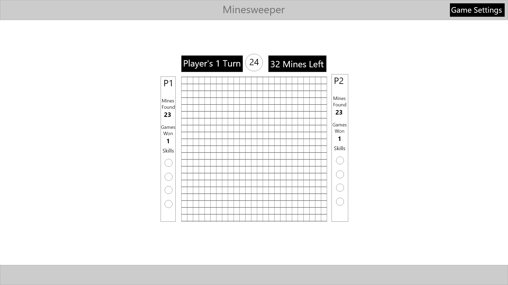
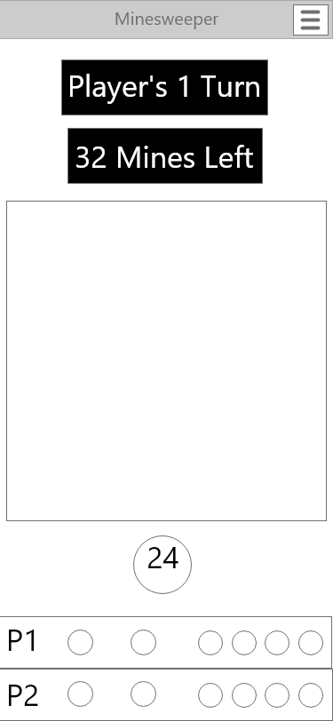

# General Assembly - Peter Banh - SEI Project 1

The purpose of this document is to detail the first project of the General Assembly's Software Engineering Immserive Program from student Peter Banh of cohort 32.

To do so, the documment will cover the following:

1. [Introdution](##1.-Introduction)
2. [Project Requirements](##2.-Project-Requirements)
3. [Game Chosen: Minesweeper](##3.-Game-Chosen:-Minesweeper)
3. [Wireframe](##4.-Wireframe)
4. [Psuedocode](##5.-Psuedocode)
5. [Technologies Used](##6.-Technologies-Used)
6. [Project Content](##7.-Project-Content)
7. [Getting Started](##8.-Getting-Started)
8. [Discussion on Development](##9.-Discussion-on-Development)
9. [Next Steps](##10.-Next-Steps)

## 1. Introduction

To showcase the Fundamentals of Front-End Development learned in the first few weeks of General Assmebly's Software Engineering Immersive Program, each student is create a browser based game as their first project.

The browser based game will be based on most, if not all, of the following:
- Fundamentals of JavaScript
- Fundamentals of HTML
- Fundamentals of CSS
- DOM Manipulation
- Event Handling
- MVC Model
- CS Flexbox, Grid and Responsive Design
- Callback Functions
- Classes
- jQuery
- 'this' keyword
- Array Iterator Methods

The game shall also meet the technical requirements as specifieid in the [project requirements](https://git.generalassemb.ly/sei-toronto/sei-4/blob/master/projects/project-1/project-1-requirements.md) detailed in section 2 of this document.

## 2. Project Requirements
As per the [projects-1-requirements](https://git.generalassemb.ly/sei-toronto/sei-4/blob/master/projects/project-1/project-1-requirements.md) project 1 shall:
- Render a game in the browser
- Include win/loss logic and render win/loss messages in HTML. Popup alerts using the alert() method are okay during development, but not production.
- Include separate HTML, CSS & JavaScript files.
- Have properly indented HTML, CSS & JavaScript. In addition, vertical whitespace needs to be consistent.
- Have no remaining dead and/or commented out code (code that will never be called).
 - Have functions and variables that are named sensibly. Remember, functions are typically named as verbs and variables (data) named as nouns.
 - Be coded in a consistent manner. For example, choose between your preference for function declarations vs. function expressions.
 - Be deployed online using GitHub Pages so that the rest of the world can play the game!
- Be one of the following games unless specified:
  - Hangman
  - War
  - Blackjack
  - Simon
  - Connect Four
  - Slot Machine
  - Mancala
  - Minesweeper
  - Roulette
  - Video Poker
  - Checkers
  - Solitaire
  - Battleship

## 3. Game Chosen: Minesweeper
The game chosen by the student Peter Banh for the completion of project 1 will be Minesweeper. Minesweeper is a puzzle video game originating in the 1960's where the objectives are the following:
 - A player must uncover all cells of a rectangular grid while using hints provided to avoid mines that are also hidden in the rectangular grid. The hints are provided in the form of a number in a cell dictating how many mines are surrounding that one particular cell (the cells that form a 3x3 square with the particular cell in the middle). 
 - Uncover all the non-mine cells as fast as possible

 The duration of the game and number of mines will be visible to the player.
 
 Depending on the difficulty, the size of the grid and the number of mines will vary. If the player uncovers a mine, they will lose the game and will be forced to reset.

 

The browser based game as close as possible to the description above, and similiar to what is being depicted above. If time is not a constraint, the following features will also be added to the browser based game in the following order:
- Two player mode where the objective is reversed, and the player must find the most mines. The player will take turns uncovering the cells to look for mines. If a mine is found the player will be allowed to continue their turn, if no mine is found the player turn will end and the next player will be allowed to uncover mines.
- Abilities in the two player mode that will allow one player to disrupt the other player's ability to find mines.
- An AI to play against the player

## 4. Wireframe
The browser based game will be expected to have the following layouts.

Players will be interacting mainly with the grid that is centered in the middle of the screen. There will also be a menu for the player to interact with in the top right to change difficulty.

Win/loss messages are not included in this mockup but will appear in the middle of the screen.

Additional features discussed in section 3 have also been included, however the first iteration of the game will take this into account and will not consider the additional features.

Considering the scope of the project, the design of the game will take a computer screen first approach considering the game is intended first.

## 5. Psuedocode

### Initialize State & Class
- Declare Play Class. This will have
  - Total mines found
  - Flag colour

- Declare GameObj Object. This will have:
  - Game Difficulty Selected - String - Easy, Normal and Hard
  - Game Difficulty Settings - Obj - Grid size and number of mines
  - Mine & Numbers Location - Obj - X & Y Coordinates of mines and numbers.
  - Empty Cell Location
  - Time Spent - Number - Starts with 0.

- Mine/Number Generator Function - Takes in settings and then randomizes coordinates of mines and inputs it into mine/number object.

### Render Functions
- Render squares in the rectangular grid.
  - Use a for loop
  - Each square requires an id with x,y coodinates

- Re-render number square
  - Takes in a number and id, find DOM element with corresponding id, and change class and update text to show the number.

- Render empty square
 - Takes in an id, finds all the empty squares surrounding it, and change all the class.

- Render Timer
  - Constantly re-rendered to show time

- Render Mine
  - Render the number of mines

- Render Win/Loss
  - Render window to show Win/Lose
  - Depending on the status, show all mines as red, or show all mines as green.
  - Window will have button to reset

### Event Handler
- Attach event listener to div holding all squares. This will be a delegated event listener. The listener will take the id of the square that was clicked and check if these coordinates are in the Mine and Numbers Location. If it is mine run Win/Loss. If it is number, re-render square. If it empty run function to uncover all empty cells surrounding it until it hits a number.
- Attach event listener to a reset button. Render all squares again. and run mine/number generator for a new mine/number layout. Also reset the time.

## 6. Technologies Used
To be added.
## 7. Project Content
To be added.
## 8. Getting Started
To be added.
## 9. Discussion on Development
To be added.
## 10. Next Steps
To be added.