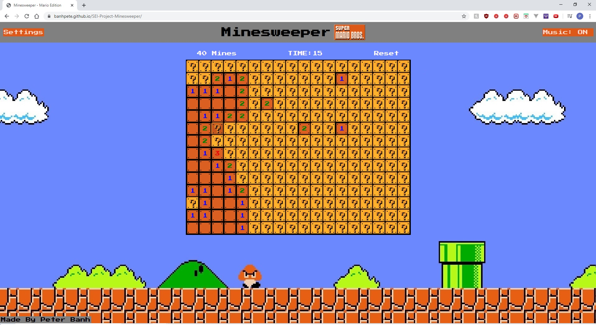
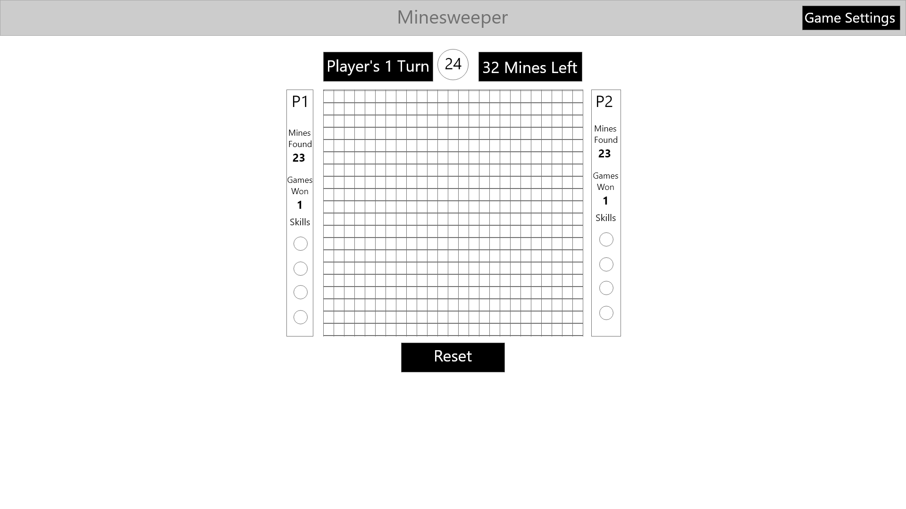
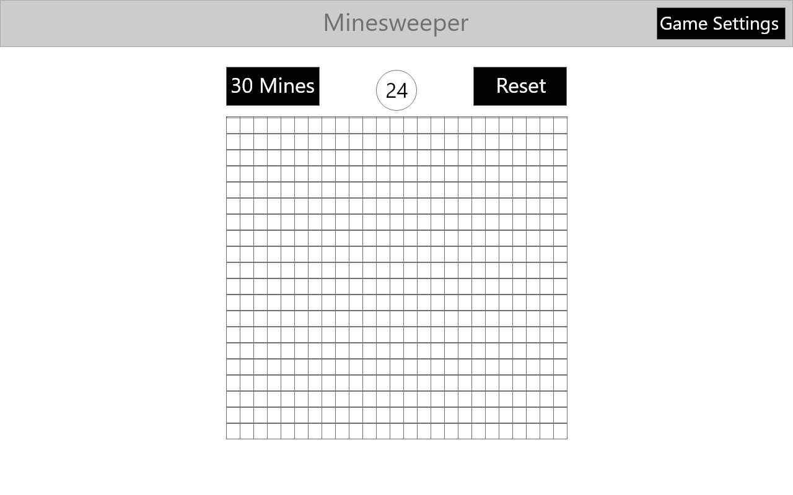
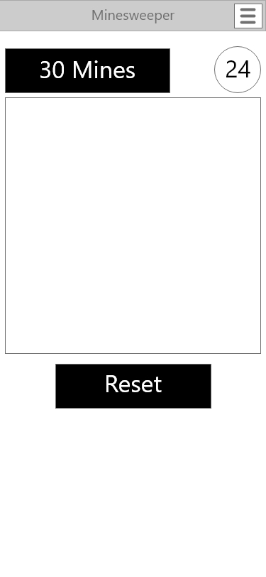

# Minesweeper - Mario NES Edition - General Assembly - SEI - Project 1 - 

Minesweeper Mario NES Edition is a browser based version of the famous Minesweeper game with a Super Mario Bros. NES theme. This browser based game was created for General Assembly's Software Engineering Immersive (SEI) Program.

## Technologies Used
The Minesweeper Mario NES Edition uses HTML, CSS and JavaScript.

## Getting Started
To play, access the browser based game here: 

https://banhpete.github.io/SEI-Project-Minesweeper/

Uncover all the cells of the grid that do not contain mines. A number in a cell uncovered in the grid indicate how many mines are around that particular cell in a 1 cell radius (the 3x3 box around the cell), use these numbers to determine where the mines are.

If any mine is clicked, the user will immediately lose and will need to reset their game.

Select the difficulty by accessing the "Settings" menu.

## Next Steps
The following are the next steps in developing the Minesweeper Mario NES Edition:
- Allow players to flag where they think the mines are.
- Allow players to see their board after losing to contemplate their loss
- Resolve latency issue in Safari browsers
- Introduce a two player option where the objective is to find all the mines instead of avoiding them.

## Development Process
To provide insight of how the browser based game was developed, the following section is dedicated to the development process. It will cover the following:

1. [Project Requirements](#1-project-requirements)
2. [Wireframe](2-wireframe)
3. [Psuedocode](#3-pseudocode)
4. [Difficulties Faced](#4-difficulties-faced)
7. [Content of the Working Version](#5-contents-of-the-working-version)

### 1. Project Requirements

The Minesweer Mario NES Edition project was created for project 1 of General Assmebly's SEI program.

The objective was to create a browser based game based on some, if not all, of the topics what was learned in the first unit (Front-End Development) of the SEI Program
- Fundamentals of JavaScript
- Fundamentals of HTML
- Fundamentals of CSS
- DOM Manipulation
- Event Handling
- MVC Model
- CS Flexbox, Grid and Responsive Design
- Callback Functions
- Classes
- jQuery
- 'this' keyword
- Array Iterator Methods

Specific technical requirements are covered in the SEI's technical requirement instructions, this is is not included in this README.

Minesweeper, the popular video game originating in the 1960's, was picked as it could include most of the points mentioned above. The browser based game was developed as close to the original game as possible.

### 2. Wireframe
Mockups for the browser based game is provided below. Adobe XD was used to create the basic mockup.

Players will be interacting mainly with the grid that is centered in the middle of the screen. There will also be a menu for the player to interact with in the top right to change difficulty.

Win/loss messages are not included in this mockup but will appear in the middle of the screen.

The intention of was the mockup was to provide guidance on how to set up the initial framework of the game, and how it can respond to width sizes. The released version deviates from the mockup slightly as the design evolved over time.

### 3. Pseudocode
The following is pseudocode that written before the actual development of the Minesweeper game to aid in the development process. It should be noted that the actual JavaScript code, while it does resemble the pseudocode, the code evolved to include more features (such as sound effects).

#### Initialize State & Class
- Declare GameObj Object. This will have:
  - Game Grid - DOM Node 
  - Timer - DOM Node
  - Game Difficulty Selected - String - Easy, Normal and Hard
  - Game Difficulty Settings - Obj - Grid size and number of mines
  - Grid X Value - Number
  - Grid Y Value - Number
  - Number of Mines - Number
  - Game Grid Values - 2D Array -  State of every cell, whether it's a mine, or empty or a number.
  - Game Grid Reveal Status - 2D Array - Array of 0 or 1 values indicating reveal status
  - Remaining Squares left to un-reveal - Number.
  - Time Spent - Number - Starts with 0.
  - Game Status - Number - 0 implies ongoing, 1 implies done

#### Update State Functions
- Mine/Number Generator Function - Takes in settings and then randomizes coordinates of mines and inputs it into Game Grid Values.
- Update Reveal Status Function - Takes in coordinates and updates that coordinate in the Game Grid Reveal Status. Then runs the re-render number square and subtract one from the remaining squares to reveal state and check if it equal to 0, if it is run the render win/loss function.
- Flood fill Function - Takes in one coordinate of empty cell, checks all neighbouring cells. When it finds a neighbouring cell:
  - If it is a empty cell and not revealed, reveal it, and then send that coordinate to the flood fill function.
  - If it is a empty cell but revealed, leave it.
  - If it is a number cell but not revealed, reveal it.
  - If it is a number cell but revealed, leave it.
- Update Time Function - Add 1 second to the current time 
- Reset Function - Delete the current game grid, and add another one, and then re run initialization. For adding the event handlers. Previous event handlers can be added over top the other one with onclick. We only need one function.

#### Initialization Function
- Runs the render squares function
- Runs the Mine/Number Generator 
- Runs the render function
- Adds Event Handler to Grid DOM for buttons click.

#### Render Functions
- Render squares in the rectangular grid.
  - Use a for loop
  - Each square requires an id with x,y coordinates
  - At the same time creates the two grids for reveal status and grid values
  - Lastly sets the number of squares left to reveal. This should be equal to gridx*gridy - number of mines.

- Re-render square
  - Takes in a number and id, find DOM element with corresponding id, and change class and update text to show the number.

- Render Timer
  - Constantly re-rendered to show time

- Render Mine
  - Render the number of mines

- Render Win/Loss
  - Render window to show Win/Lose
  - Checks the remaining squares to determine if win/loss.
  - Depending on the status, show all mines as red, or show all mines as green.
  - Window will have button to reset

#### Event Handler
- Attach event listener to div holding all squares. This will be a delegated event listener. The listener will take the id of the square that was clicked and check if these coordinates are in the Mine and Numbers Location.
  - If time in the gameObj is 0, then start the timer interval.
  - If it is mine run the win/loss function. 
  - If it is number, re-render square. 
  - If it empty run the flood fill to find all neighbouring empty cells. All these functions shall update the reveal grid.
- Attach event listener to a reset button. Render all squares again. and run mine/number generator for a new mine/number layout. Also reset the time.

#### Function Interval
- Run Update Time Function every second and then run render timer function.

### 4. Difficulties Faced
During development, the following are some of the challenges that came up:
- **Development of the flood-fill function.** This is the function that allows the the reveal of cells to propagate through the grid when it is required. This was eventually determined after testing and review of solutions online. Recursion was used for the propagation throughout the grid, and setTimeOut was used to give it a wave effect.
- **Preventing the player from losing when they first click on the grid.** Initially, the location of the mines were static, and a user could have easily lost in their first move if they clicked on a mine, this was especially true if the setting was set to hard. To prevent this, the logic was further developed such that wherever a player starts the game, all mines in a 3x3 area around the player click was relocated else where. Therefore the first click always allows for the several cells to be uncovered.
- **Ensuring responsiveness.** To ensure responsiveness, CSS and JavaScript was used, and several trial and error was done. CSS covers responsiveness using media queries, but since the size of the cells are determined using JavaScript, JavaScript was also used to determine square sizes at a smaller width.
- **Ensuring the game grid actually is as per Minesweeper Logic, i.e. the number four actually has four mines around it.** A test function was included after to go through the array and check every number. This was important to use when testing how the relocation of mines affected the grid.
- **Finding the sounds and the sprite of the Mario NES game and ensuring they are large files.** The following links were used for the sound and sprite:
  - Sound Effects - https://www.youtube.com/watch?v=5yrFdhNG2Sk
  - Themesong - https://www.youtube.com/watch?v=iy3qq7zc4EY
  - Background - https://wall.alphacoders.com/big.php?i=333222
  - Blocks - https://www.clipartkey.com/view/iiRTxoo_mario-blocks-pixel-art-mario-block-mario-jumping/
  - Explosion - http://www.mariouniverse.com/sprites-nes-smb/
  - Mario Running - https://www.spriters-resource.com/nes/supermariobros/
  - Mario Falling - http://www.mariomayhem.com/downloads/sprites/super_mario_bros_sprites.php
  - Logo - https://www.lastpodcastnetwork.com/blog/2018/11/22/super-mario-bros

  Sound effects and themesong were all converted to mp3 to reduce file size. Some sound effects were edited to further reduce file size by removing parts that contained no audio. Theme song was edited for repeatability. 

### 5. Contents of the Working Version
The working version of the Minesweeper Mario NES edition consists of the following:
- index.html - The main page that users will interact with
- style.css - The style for the main page
- main.js - The code for the minesweeper game
- /Sounds - Folder containing the sound effects of the game
- /Images - Folder containing the images used in the game
